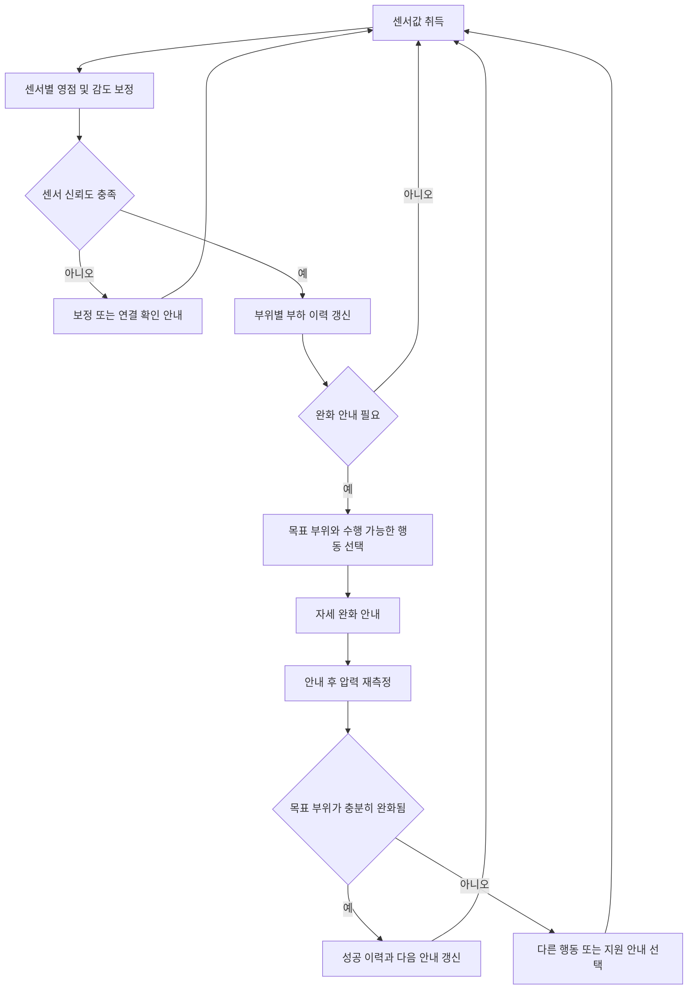

# 부위별 누적 부하와 센서 신뢰도를 이용한 자세 완화 안내 시스템 특허 초안

## 문서 목적과 핵심 결론

본 발명의 목적은 욕창 방지 매트리스나 방석 자체의 지지 성능을 대체하는 것이 아니라, 사용자가 동일 부위에 압력을 오래 유지하지 않도록 이해하기 쉬운 완화 행동을 안내하고 그 행동의 실제 효과를 센서로 확인하는 데 있다. 특히 센서 편차나 배선 이상이 있는 상태에서 잘못된 자세 안내를 제공하지 않도록 센서 신뢰도 판정과 안내 제어를 결합한다.

핵심 구성은 다음 두 기능의 결합이다.

1. 부위별 부하 이력을 유지하고 자세 변화 전후의 압력 감소를 비교하여 완화 여부를 판정한 뒤 다음 안내를 갱신하는 기능
2. 센서별 영점, 감도, 고정값, 포화 및 편차 상태를 판단하여 보정 안내를 제공하고, 측정 신뢰도가 확보된 경우에만 자세 완화 안내를 실행하는 기능

두 기능은 독립적으로 나열되지 않는다. 센서 신뢰도 판정 결과가 부하 이력의 유효성과 안내 실행 여부를 제어하고, 안내 후 측정된 완화 결과가 이후의 안내 부위와 행동을 갱신한다. 이 폐루프 관계가 발명의 중심이다.

## 현재 개발 단계

현재 프로토타입은 ESP32-C3에 연결된 5개 압력 센서의 값을 BLE로 전송하고, 모바일 앱에서 보정된 센서값과 보간 압력 분포를 표시하는 단계다.

| 구분 | 현재 상태 | 다음 구현 |
| --- | --- | --- |
| 센서 수집 | 5개 센서의 mV 기반 상대 압력값 수집 | 센서 상태 진단 결과를 패킷에 포함 |
| 센서 보정 | 무부하 영점 보정 및 최초 1회 센서별 감도 보정 | 장기 편차와 고정값 이상 판정 |
| 압력 표시 | 5개 센서값을 이용한 48 곱하기 72 RBF 보간 그리드 | 신뢰도가 낮은 영역의 별도 표시 |
| 부하 이력 | 미구현 | 부위별 누적 부하와 회복 이력 저장 |
| 자세 안내 | 미구현 | 한 번에 하나의 구체적인 완화 행동 안내 |
| 완화 판정 | 미구현 | 안내 전후 부하 감소율과 유지시간 비교 |
| 안내 갱신 | 미구현 | 성공 이력과 사용자 수행 가능성을 반영한 다음 안내 선택 |

따라서 자세 및 자세 변화 안내 UI는 개념 정의 단계이며, 센서 수집과 보정 기반은 구현된 상태다. 인터뷰에서는 완성된 자세 판정 기능을 검증하기보다 사용자가 이해하고 수행할 수 있는 안내 방식, 안내 빈도, 표현 및 성공 피드백을 확인하는 것이 적절하다.

## 해결하려는 기술 문제

기존 압력 측정 제품은 현재 압력 분포를 시각화하거나 일정 시간이 지나면 자세 변경을 알리는 데 그칠 수 있다. 이 경우 다음 문제가 남는다.

- 현재 압력이 낮더라도 특정 부위가 장시간 반복적으로 눌렸는지 알기 어렵다.
- 사용자가 안내에 따라 움직였더라도 목표 부위의 부하가 실제로 줄었는지 확인하지 않는다.
- 센서의 영점 이동이나 감도 차이가 자세 비대칭으로 오인될 수 있다.
- 센서 이상 상태에서도 같은 강도의 행동 안내가 계속되어 신뢰를 떨어뜨릴 수 있다.
- 모든 사용자에게 동일한 동작을 요구하면 장애 특성이나 업무 환경 때문에 수행하기 어려울 수 있다.

본 발명은 측정, 판단, 안내, 행동 및 재측정을 하나의 제어 흐름으로 연결하여 이러한 문제를 해결한다.

## 통합 시스템 구성

### 압력 취득부

복수의 압력 센서로부터 센서값을 주기적으로 취득한다. 실시예에서는 방석의 후방 좌우, 중앙 및 전방 좌우에 5개 센서를 배치한다. 센서값은 무부하 기준 전압과의 차이로 변환하며, 센서별 감도 보정계수를 적용한다.

현재 구현은 10 kOhm 고정저항과 FSR로 구성된 전압 분배 회로를 사용한다. 회로는 3.3 V, 고정저항, ADC 측정점, FSR, GND 순서로 연결되므로 FSR에 가해지는 힘이 증가하면 측정 전압이 감소한다. ESP32-C3의 GPIO 0부터 GPIO 4까지를 ADC 입력으로 사용한다.

### 현재 구현된 신호처리 필터

현재 펌웨어의 신호처리는 이동 평균, 중앙값 필터, 스칼라 칼만 필터 및 센서별 감도 보정 순서로 수행된다. 앱은 보정 결과를 가우시안 방사기저함수 RBF로 보간한다.

| 처리 단계 | 현재 설정 | 적용 목적 |
| --- | --- | --- |
| ADC 다중 표본 평균 | 센서별 32회 측정 평균 | ADC의 단기 랜덤 잡음 감소 |
| 5점 중앙값 필터 | 최근 5개 표본의 중앙값 | 순간 스파이크와 단발성 이상값 제거 |
| 스칼라 칼만 필터 | 프로세스 잡음 0.5, 측정 잡음 4.0 | 출력의 흔들림을 줄이면서 압력 변화 추종 |
| 센서별 영점 보정 | 무부하 상태에서 5초 평균 | 센서와 회로마다 다른 무부하 전압 제거 |
| 센서별 감도 보정 | 균일 기준 하중에 대한 중앙 반응값 사용 | 동일 하중에 대한 센서별 출력 편차 완화 |
| 가우시안 RBF 보간 | 시그마 0.34, 정규화 계수 0.002 | 5개 측정점 사이의 공간 분포 추정 |

ADC의 k번째 측정 주기에서 센서 i를 32회 읽은 평균 전압은 다음과 같다.

$$
\bar{v}_i[k]
= \frac{1}{N}\sum_{n=1}^{N}v_i[k,n],
\qquad N=32
$$

현재 측정 주기의 목표 간격은 50 ms이며 약 20 Hz로 갱신한다. 32회 평균값에 단발성 스파이크가 포함될 수 있으므로 최근 5개 측정값의 중앙값을 사용한다.

$$
z_i[k]
= \operatorname{median}\!\left(
\bar{v}_i[k-4],\ldots,\bar{v}_i[k]
\right)
$$

중앙값 필터의 출력은 센서마다 독립적인 1차원 칼만 필터로 평활화한다. k번째 예측 오차, 칼만 이득, 추정값 및 갱신 오차는 다음과 같다.

$$
\begin{aligned}
P_i^{-}[k] &= P_i[k-1] + Q, \\
K_i[k] &= \frac{P_i^{-}[k]}{P_i^{-}[k]+R}, \\
x_i[k] &= x_i[k-1]
          +K_i[k]\left(z_i[k]-x_i[k-1]\right), \\
P_i[k] &= \left(1-K_i[k]\right)P_i^{-}[k], \\
Q &= 0.5, \qquad R=4.0
\end{aligned}
$$

위 식에서 $x_i[k]$는 필터링된 센서 전압이고 $P_i[k]$는 추정 오차다.

### 영점 보정과 센서별 감도 보정

무부하 영점 $b_i$는 방석에 하중이 없는 5초 동안 취득한 평균 전압으로 계산한다.

$$
b_i=\frac{1}{M}\sum_{k=1}^{M}\bar{v}_i[k]
$$

영점 보정이 완료되면 중앙값 필터 버퍼를 $b_i$로 채우고 칼만 추정값을 $b_i$, 추정 오차를 1.0으로 초기화한다. 현재 ESP32-C3 실시예에서는 무부하 기준값이 2500 mV 미만이면 배선, 단락 또는 잔류 하중을 확인하도록 영점 보정 실패 상태를 출력한다.

최초 사용 시에는 평평한 판과 균일한 기준 하중을 사용하여 각 센서의 반응량을 구한다.

$$
\begin{aligned}
d_i &= b_i-v_i^{\mathrm{ref}}, \\
d_{\mathrm{target}}
&=\operatorname{median}(d_1,d_2,d_3,d_4,d_5), \\
g_i
&=\operatorname{clip}\!\left(
\frac{d_{\mathrm{target}}}{d_i},\,0.5,\,2.0
\right)
\end{aligned}
$$

$v_i^{\mathrm{ref}}$는 기준 하중 상태의 5초 평균 전압이고 $g_i$는 센서별 감도 보정계수다. 반응량 $d_i$가 25 mV 미만이면 기준 하중이 센서에 충분히 전달되지 않은 것으로 판정한다. 감도 보정계수는 0.5부터 2.0 범위로 제한하여 매우 작은 반응량이 과도한 증폭으로 이어지는 것을 막고, 계산된 계수는 ESP32의 비휘발성 메모리에 저장한다.

최종 상대 부하값은 다음과 같다.

$$
p_i[k]
=\max\!\left(0,\,\left(b_i-x_i[k]\right)g_i\right)
$$

현재 값은 mV 변화량을 기반으로 한 상대 부하값이며 Pa 또는 kgf와 같은 절대 물리량이 아니다. 별도의 복수 기준 하중으로 전달함수를 구하면 물리량으로 환산하는 실시예도 포함할 수 있다.

### 압력 분포 보간

앱은 5개 센서값을 48열 72행의 압력 분포로 확장한다. 센서 위치 `s_i`와 임의의 그리드 위치 `x` 사이의 가우시안 커널은 다음과 같다.

$$
\phi(\mathbf{x},\mathbf{s}_i)
=\exp\!\left(
-\frac{\lVert\mathbf{x}-\mathbf{s}_i\rVert^2}{2\sigma^2}
\right),
\qquad \sigma=0.34
$$

센서 위치 사이의 커널 행렬과 RBF 가중치는 다음과 같이 계산한다.

$$
\begin{aligned}
A_{ij}
&=\phi(\mathbf{s}_i,\mathbf{s}_j)+\lambda\delta_{ij}, \\
\mathbf{w}
&=\mathbf{A}^{-1}\mathbf{p}, \\
\widehat{P}(\mathbf{x})
&=\operatorname{clip}\!\left(
\sum_{i=1}^{5}w_i\phi(\mathbf{x},\mathbf{s}_i),\,0,\,3200
\right), \\
\lambda&=0.002
\end{aligned}
$$

$\delta_{ij}$는 $i=j$일 때 1인 크로네커 델타이고, 정규화 계수 $\lambda$는 센서 위치가 가까울 때 발생할 수 있는 수치 불안정을 줄인다. 현재 앱은 부분 피벗을 사용하는 가우스 조던 소거법으로 선형시스템을 풀고 그 결과를 캐시한다. RBF 그리드는 5개 실측값으로부터 계산한 공간 추정치이므로 추가 센서의 실측값으로 해석하지 않는다.

### 센서 상태 판정부

센서 상태 판정부는 다음 중 하나 이상을 이용해 센서별 신뢰 상태를 결정한다.

- 무부하 기준값이 정상 범위를 벗어나는지 여부
- 일정 시간 동안 값이 변하지 않는 고정값 상태
- 측정 상한 또는 하한에 계속 머무는 포화 상태
- 인접 센서 또는 과거 자기 값과 비교한 편차
- 무부하 측정 중 분산이나 최대 최소 범위가 허용값을 넘는 상태
- 기준 하중에 대한 센서별 반응량과 감도 보정계수의 허용범위 이탈

판정 결과는 정상, 보정 필요, 연결 확인 필요 또는 측정 제외 상태와 같이 구분할 수 있다. 상태가 불안정하면 해당 센서의 가중치를 낮추거나 부하 이력 갱신을 보류한다. 안내에 필요한 최소 신뢰도가 확보되지 않으면 자세 변경 안내 대신 방석을 비우기, 배선 확인하기 또는 다시 보정하기와 같은 보정 안내를 제공한다.

센서 이상 판정을 구현하는 한 실시예는 다음과 같다. 아래 항목은 특허 실시예를 위한 확장안이며 현재 프로토타입에는 무부하 범위와 기준 하중 반응량 검사만 구현되어 있다.

$$
\begin{aligned}
\bar{x}_i[t]
&=\frac{1}{W}\sum_{k=t-W+1}^{t}x_i[k], \\
\operatorname{Var}_i[t]
&=\frac{1}{W}\sum_{k=t-W+1}^{t}
\left(x_i[k]-\bar{x}_i[t]\right)^2, \\
\operatorname{Range}_i[t]
&=\max_{k\in\mathcal{W}_t}x_i[k]
-\min_{k\in\mathcal{W}_t}x_i[k], \\
D_i[t]
&=\frac{
\left|p_i[t]-\operatorname{median}(\mathbf{p}_{\mathcal{N}_i}[t])\right|
}{
\operatorname{MAD}(\mathbf{p}_{\mathcal{N}_i}[t])+\varepsilon
}
\end{aligned}
$$

여기서 최근 표본 구간은 $\mathcal{W}_t=\{t-W+1,\ldots,t\}$이고, $\mathcal{N}_i$는 센서 $i$의 인접 센서 집합이다. 고정값 이상은 $\operatorname{Range}_i<\varepsilon_{\mathrm{stuck}}$인 동안 인접 센서가 변하는 경우, 포화 이상은 ADC 상한 또는 하한 상태가 $T_{\mathrm{sat}}$ 이상 유지되는 경우, 편차 이상은 $D_i>\theta_{\mathrm{dev}}$가 $T_{\mathrm{dev}}$ 이상 유지되는 경우로 정의할 수 있다.

$\operatorname{MAD}$는 중앙절대편차이고 $\varepsilon$은 0으로 나누는 것을 방지하는 작은 양수다. 각 조건으로부터 센서 신뢰 가중치 $q_i$를 0부터 1 사이로 만들 수 있다. $q_i$가 기준 미만이면 해당 센서값을 부하 이력에서 제외하거나 낮은 가중치로 반영하고, 유효 센서 수가 최소 개수보다 적으면 자세 안내를 보류한다.

### 부위별 부하 이력 관리부

보정된 센서값 또는 보간된 압력 분포를 좌측 둔부, 우측 둔부, 중앙, 전방 좌측 및 전방 우측과 같은 복수의 신체 지지 부위에 대응시킨다. 각 부위에는 현재 압력만이 아니라 시간에 따른 부하 이력을 유지한다.

부위 r의 유효 압력은 해당 부위에 영향을 주는 센서 신뢰 가중치를 반영하여 계산한다.

$$
P_r^{\mathrm{eff}}[k]
=\frac{
\sum_i q_i[k]a_{r,i}p_i[k]
}{
\sum_i q_i[k]a_{r,i}
}
$$

$a_{r,i}$는 센서 $i$가 부위 $r$에 미치는 공간 가중치다. RBF 보간계수를 사용하거나 센서와 부위 중심 사이의 거리에 따라 정할 수 있다. 신뢰 가능한 센서가 없으면 해당 부위의 유효 압력을 미정 상태로 두고 이력을 갱신하지 않는다.

누적 부하는 압력과 지속시간을 함께 반영한다. 임계값을 넘는 부하를 누적하고 완화된 시간에는 이력을 감쇠시키는 한 실시예는 다음과 같다.

$$
L_r[k]
=\max\!\left(0,\,P_r^{\mathrm{eff}}[k]-\theta_r^{\mathrm{load}}\right)
$$

$$
E_r[k]
=\max\!\left(
0,\,
\rho E_r[k-1]
+q_r[k]L_r[k]\Delta t
-\mu\,\mathbb{I}\!\left[
P_r^{\mathrm{eff}}[k]<\theta_r^{\mathrm{relief}}
\right]\Delta t
\right)
$$

$E_r$은 부위별 누적 부하, $\rho$는 과거 이력의 감쇠계수, $\Delta t$는 측정 간격, $\mu$는 완화 시 회복계수, $q_r$은 해당 부위의 종합 신뢰도다. $\mathbb{I}$는 조건이 참일 때 1인 지시함수다. 임계값과 계수는 사용자 프로필, 방석 종류, 업무 시간 또는 전문가 설정에 따라 달라질 수 있다.

### 완화 행동 안내부

안내부는 누적 부하가 높은 목표 부위를 선정하고 그 부위의 압력을 낮출 가능성이 있는 행동 후보를 선택한다. 안내는 진단명이나 단정적인 교정 표현보다 사용자가 즉시 수행할 수 있는 동작으로 제시한다.

안내 예시는 다음과 같다.

- 왼쪽 부하가 누적됐어요. 가능한 범위에서 몸을 오른쪽으로 조금 옮겨 주세요.
- 중앙 부하가 오래 유지됐어요. 팔걸이를 이용해 엉덩이를 잠시 들어 주세요.
- 지금 동작이 어렵다면 나중에 알림을 선택하거나 가능한 다른 동작을 선택해 주세요.

한 화면에는 하나의 주요 행동만 제시하고, 동작의 대상 부위와 권장 유지시간을 함께 표시한다. 시각 안내 외에 음성, 진동, 큰 글자 및 보호자 알림을 선택적으로 제공할 수 있다.

### 완화 판정부

사용자가 안내를 수행한 뒤 목표 부위의 안내 전 기준 부하와 안내 후 부하를 비교한다. 단일 순간값 대신 일정 구간의 평균값, 중앙값 또는 누적값을 사용할 수 있다.

$$
P_r^{\mathrm{before}}
=\operatorname{mean}_{k\in\mathcal{T}_{\mathrm{before}}}
P_r^{\mathrm{eff}}[k],
\qquad
P_r^{\mathrm{after}}
=\operatorname{mean}_{k\in\mathcal{T}_{\mathrm{after}}}
P_r^{\mathrm{eff}}[k]
$$

$$
R_r
=\frac{
P_r^{\mathrm{before}}-P_r^{\mathrm{after}}
}{
\max\!\left(P_r^{\mathrm{before}},\varepsilon\right)
}
$$

완화율이 기준 $\eta_{\mathrm{success}}$ 이상이고 낮아진 부하가 최소 유지시간 $T_{\mathrm{hold}}$ 이상 지속되면 완화 성공으로 판정한다. 완화율이 $\eta_{\mathrm{partial}}$ 이상이면 부분 완화, 그보다 낮으면 미완화로 판정할 수 있다. 평가 구간의 센서 신뢰도가 기준 이하이면 완화 판정을 보류하고 보정 안내로 전환한다.

### 안내 갱신부

안내 갱신부는 완화 결과를 다음 안내에 반영한다.

- 성공한 동작은 동일 부위에 대한 우선 후보로 유지한다.
- 효과가 없었던 동작은 반복 횟수를 제한하고 다른 동작으로 교체한다.
- 반대쪽 부위의 누적 부하가 급격히 증가하면 과도한 체중 이동으로 보고 안내 강도를 낮춘다.
- 사용자가 수행 불가로 표시한 동작은 후보에서 제외하거나 보호자 지원 동작으로 전환한다.
- 센서 이상이 발생하면 기존 성공 이력을 삭제하지 않고 현재 판정만 보류한다.

이로써 시스템은 단순히 자세 변경을 요구하는 것이 아니라, 해당 사용자에게 실제로 부하를 줄였던 행동을 반복적으로 학습하고 안내한다.

## 제어 상태 흐름

## 특허 차별화 방향

압력 센서를 이용한 자세 표시, 누적 압력 프로필, 자세 피드백 및 쿠션의 자동 조절은 각각 선행기술에서 확인된다. 따라서 권리화의 초점은 단순 압력맵이나 자세 알림 자체보다 다음 기능적 결합에 두는 것이 적절하다.

1. 센서별 이상 상태가 부위별 부하 이력의 갱신 여부와 자세 안내의 실행 여부를 제어한다.
2. 안내 전후의 목표 부위 부하를 비교해 완화 성공 여부를 센서값으로 판정한다.
3. 완화 성공 여부와 부위별 누적 이력을 함께 사용해 다음 행동 안내를 변경한다.
4. 센서 신뢰도가 낮을 때는 자세 안내를 중단하고 원인에 대응하는 보정 안내를 제공한다.
5. 특정 매트리스 구조나 자동 구동부에 종속되지 않고 기존 욕창 방지 방석 또는 매트리스에 부가할 수 있다.

특히 독립항에서는 센서 보정과 안내를 병렬적인 부가기능으로 작성하지 않고, 센서 상태 판정 결과가 부하 이력과 안내 제어에 영향을 주는 관계 및 안내 결과가 후속 안내를 갱신하는 관계를 명시해야 한다.

## 청구항 구성 초안

### 독립항 시스템

복수의 압력 센서로부터 사용자의 신체 부위별 압력값을 취득하는 압력 취득부, 센서별 기준값 및 감도 보정계수를 이용해 보정 압력값을 생성하는 센서 보정부, 센서별 측정값의 시간 변화와 센서 간 편차 중 하나 이상을 이용해 센서 신뢰 상태를 판정하는 센서 상태 판정부, 신뢰 상태가 기준을 충족하는 보정 압력값을 이용해 부위별 부하 이력을 갱신하는 부하 이력 관리부, 부하 이력에 따라 완화 대상 부위와 자세 변화 행동을 정하여 사용자 단말에 안내하는 안내부, 안내 전후의 완화 대상 부위 부하를 비교해 완화 여부를 판정하는 완화 판정부 및 완화 여부에 따라 후속 자세 변화 행동을 갱신하는 안내 갱신부를 포함하며, 센서 신뢰 상태가 기준을 충족하지 않으면 부하 이력의 갱신 또는 자세 변화 안내를 제한하고 센서 보정 안내를 출력하는 것을 특징으로 하는 자세 완화 안내 시스템.

### 독립항 방법

복수의 압력 센서값을 취득하는 단계, 센서별 기준값과 감도 보정계수로 압력값을 보정하는 단계, 센서별 시간 변화 또는 센서 간 편차로 센서 신뢰 상태를 판정하는 단계, 신뢰 상태가 기준을 충족하는 센서값으로 부위별 부하 이력을 갱신하는 단계, 누적 부하에 따라 완화 대상 부위와 자세 변화 행동을 안내하는 단계, 안내 전후의 목표 부위 부하를 비교해 완화 여부를 판정하는 단계 및 완화 여부를 이용해 후속 안내를 갱신하는 단계를 포함하며, 센서 신뢰 상태가 기준을 충족하지 않으면 자세 변화 안내 대신 센서 보정 안내를 제공하는 자세 완화 안내 방법.

### 종속항 후보

1. 부하 이력이 압력값과 지속시간의 누적값을 포함하는 구성
2. 부하가 임계값 이하인 시간에 따라 누적 부하를 감쇠시키는 구성
3. 완화 여부를 안내 전후 일정 구간의 평균 또는 중앙값으로 판단하는 구성
4. 완화 상태가 최소 유지시간 이상 지속될 때 성공으로 판정하는 구성
5. 고정값, 포화값, 무부하 편차, 센서 간 편차 또는 측정 분산으로 센서 이상을 판정하는 구성
6. 이상 센서에 대응하는 영역의 가중치를 낮추거나 부하 이력 갱신을 보류하는 구성
7. 최초 기준 하중 측정으로 센서별 감도 보정계수를 산출하고 비휘발성 메모리에 저장하는 구성
8. 성공한 행동, 실패한 행동 또는 수행 불가 행동의 이력으로 다음 행동 후보의 우선순위를 변경하는 구성
9. 반대쪽 부위의 부하 증가가 기준을 넘으면 과도한 이동으로 판정하는 구성
10. 기존 방석 또는 매트리스와 분리 가능한 센서 모듈 및 사용자 단말을 포함하는 구성
11. 음성, 진동, 큰 글자 또는 보호자 알림 중 하나 이상으로 안내하는 구성
12. 사용자가 수행 가능한 동작 범위를 입력받아 안내 후보를 제한하는 구성

## 발표에서 사용할 문제 정의

발표에서는 다음과 같이 설명하면 현재 개발 단계와 사업 목적의 모순을 줄일 수 있다.

> 기존 욕창 방지 방석과 매트리스는 압력을 분산하는 중요한 기반 장치다. 그러나 사용자가 같은 부위에 얼마나 오래 부하를 유지했는지, 안내받은 자세 변화가 실제로 그 부위를 완화했는지, 센서가 신뢰할 수 없는 상태에서 안내가 잘못되지 않는지까지 관리하려면 별도의 안내 체계가 필요하다. 우리는 기존 제품을 대체하기보다 그 위에 측정 기반의 안내와 행동 변화 지원 기능을 더하려 한다.

피해야 할 표현은 다음과 같다.

- 욕창을 예방하거나 치료한다고 단정하는 표현
- 올바른 자세를 시스템이 확정적으로 진단한다는 표현
- 모든 사용자에게 동일한 자세가 적합하다는 표현
- 센서값만으로 임상 위험을 판정한다는 표현
- 기존 욕창 방지 제품에는 효과가 없다는 표현

대신 부위별 부하를 인지하도록 돕는다, 가능한 완화 행동을 제안한다, 행동 후 부하 변화를 확인한다, 기존 방석과 매트리스의 사용을 보조한다는 표현을 사용한다.

## 장애인 근로자 인터뷰 항목

인터뷰에서는 발명의 세부 수치보다 안내의 수용성과 수행 가능성을 확인한다.

### 업무와 자세 변화 맥락

- 업무 중 스스로 자세를 바꾸기 어려운 상황은 언제인가
- 팔걸이, 책상 또는 보조기기를 이용한 체중 이동이 가능한가
- 자세 변화에 다른 사람의 도움이 필요한 경우가 있는가
- 집중을 방해하지 않는 알림 간격과 방식은 무엇인가

### 안내 표현

- 좌우 이동, 엉덩이 들기, 기대기 중 이해하기 쉬운 표현은 무엇인가
- 압력 수치, 색상 지도 또는 간단한 행동 문장 중 무엇이 유용한가
- 성공 여부를 어떤 방식으로 알려주는 것이 부담이 적은가
- 실패라는 표현 대신 다시 시도, 다른 동작 선택 또는 나중에 알림 중 무엇을 선호하는가

### 접근성과 선택권

- 큰 글자, 음성, 진동 및 보호자 알림 중 필요한 방식은 무엇인가
- 수행할 수 없는 동작을 미리 제외하는 설정이 필요한가
- 안내를 잠시 미루거나 업무 일정에 맞춰 조정할 필요가 있는가
- 압력 이력을 본인, 관리자 또는 보호자 중 누구와 공유해도 되는가

### 신뢰와 안전

- 센서 오류나 보정 필요 상태를 어떻게 설명하면 신뢰할 수 있는가
- 측정이 불안정할 때 자세 안내를 중단하는 것이 이해되는가
- 어떤 데이터가 저장되는지 어느 수준까지 설명받기를 원하는가

## 출원 전 확보할 자료

- 5개 센서의 실제 물리적 위치와 각 센서가 대응하는 부위
- 무부하 정상범위, 고정값과 포화 판정값 및 허용 분산
- 누적 부하 계산식의 실시예와 사용한 시간 단위
- 안내 전 기준 구간, 안내 후 평가 구간 및 완화 성공 기준의 실시예
- 센서 이상 시 부하 이력을 유지, 감쇠 또는 보류하는 구체적인 상태 전이
- 최소 2개 이상의 자세 변화 행동과 각 행동이 목표로 하는 부위
- 사용자가 동작을 수행하지 못했을 때의 대체 흐름
- 보정 실패, 안내 성공, 부분 완화 및 미완화 화면 예시
- 인터뷰 참여자의 요구를 반영한 접근성 실시예

특허 명세서는 출원 당시 공개된 내용이 이후 보정의 근거가 된다. 구현 예정인 변형도 출원 초안에 충분히 포함해야 하며, 선행기술 조사를 거쳐 독립항과 종속항의 범위를 조정해야 한다.

## 공개와 출원 순서

한국의 공지예외주장 제도는 일정 요건에서 발명자의 출원 전 공개를 선행기술에서 제외할 수 있지만 출원일 자체가 공개일로 소급되지는 않는다. 제3자의 독립적인 공개나 해외 출원에는 별도 위험이 남을 수 있으므로 예외에 의존하기보다 공개 전에 출원일을 확보하는 방향이 안전하다.

다음 주 인터뷰 전 권장 순서는 다음과 같다.

1. 발명자와 권리 귀속 주체를 정리한다.
2. 본 문서의 시스템 흐름, 변형예 및 도면을 포함해 변리사 검토를 받는다.
3. 정규 명세서 또는 임시명세서 출원 가능성을 검토한다.
4. 출원 전 인터뷰라면 비밀유지 의사를 명확히 하고 특허 핵심 수치와 알고리즘 공개를 제한한다.
5. 인터뷰에서는 문제, 사용 경험, 안내 방식 및 접근성 요구를 중심으로 질문한다.

## 참고 자료와 선행기술 검토 출발점

- [지식재산처 특허 출원 절차](https://kipo.go.kr/kcall/faqRead.do?curMenuCd=SCD0300090&pgmId=PGM0000014&pgmSeq=8&sysCd=SCD03&urlDo=cFaqAEList.do)
- [지식재산처 공지예외주장 제도](https://www.kipo.go.kr/ko/kpoContentView.do?menuCd=SCD0200239)
- [WIPO Patent Drafting Manual](https://www.wipo.int/publications/en/details.jsp?id=4706&plang=EN)
- [WIPO PCT 청구항 명확성 지침](https://www.wipo.int/en/web/pct-system/texts/ispe/5_31_41)
- [US10085570B2 Posture detection and correction cushion](https://patents.google.com/patent/US10085570B2/en)
- [EP4284233B1 Pressure monitoring device system and method](https://patents.google.com/patent/EP4284233B1/en)
- [US20240335340 Measuring and adjusting pressure of support cushions](https://patents.justia.com/patent/20240335340)

위 선행기술 목록은 신규성 또는 진보성 판단을 완료한 조사 결과가 아니라 청구항 차별화를 시작하기 위한 예비 목록이다. 국내외 특허 데이터베이스에서 누적 부하, 안내 후 완화 판정, 센서 이상 기반 안내 제한 및 사용자별 행동 갱신의 결합을 추가로 조사해야 한다.
